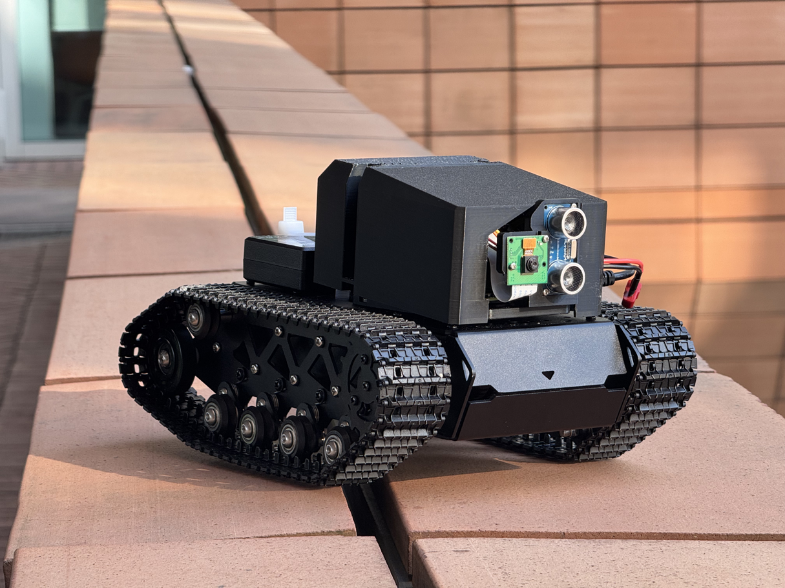

  Visualized Intelligent Tracking Cart
  
  [Testing VDO Download Link](./tank_test_vdo.mp4)

  Bambu Lab A1 - 3D printing for shell/bracket
  [Hiwonder track Chassis](https://item.taobao.com/item.htm?id=743466510881&skuId=5300104307620&spm=a21xtw.29978516.0.0) - bought on Taobao

  **Software**
  Mediapipe - human tracking 
  ROS - publish speed command to motors

  **Hardware**
  Raspberry Pi 4B
  [Hiwonder SA8339 Motor driver board](https://item.taobao.com/item.htm?abbucket=4&detail_redpacket_pop=true&id=777535784787&ltk2=1745175193030nlgx5yha7n8rdb4sfs5vm&ns=1&priceTId=2100c82817451751933341305e0c36&query=%E5%9B%9B%E8%B7%AF%E7%BC%96%E7%A0%81%E7%94%B5%E6%9C%BA%E9%A9%B1%E5%8A%A8%E6%A8%A1%E5%9D%97%20%E6%9D%BF%E8%BD%BD%E7%A8%B3%E5%8E%8B%E7%94%B5%E8%B7%AF%E9%A9%AC%E8%BE%BE%E6%8E%A7%E5%88%B6%E6%99%BA%E8%83%BD&skuId=5313474380586&spm=a21n57.1.hoverItem.2&utparam=%7B%22aplus_abtest%22%3A%22aa2d942e400190137800de3656e71fd6%22%7D&xxc=taobaoSearch) - receive command and drive motors
  HC-SR04 - distance measurements
  JGB520 - motors
  PS2 joystick - manual control
  
  ***
  This is the code for IDAT7212 project 2024FAll
  
  Group member:
  He Yuyuan 
  
  Luo qi
  
  Wang chenyu
  
  Lei Ruiqi
  
  Yan Haowei
  
  Xu Ruize
  
  Ding luqi
  
  Lin Haochuan
  
  Pu Baiyu
